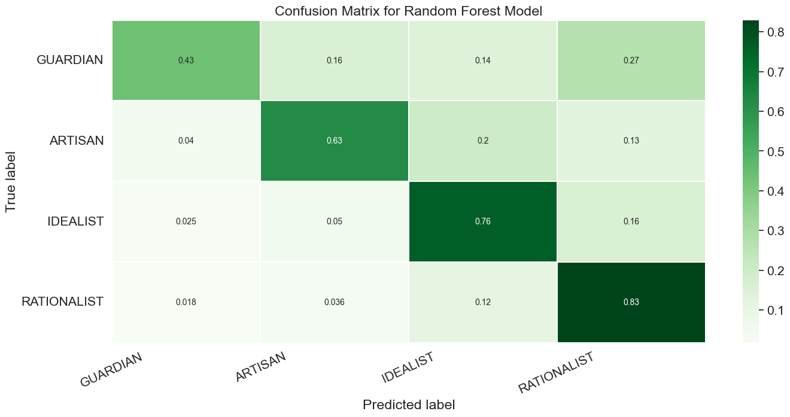
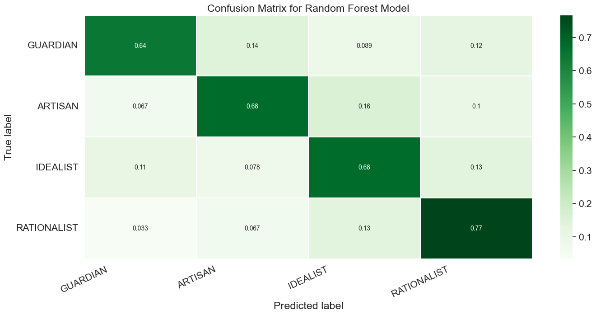

# Accuracy comparison of random forest and hybrid neural network models for the classification of text into Keirsey model personality types

This repository is for a research paper presented at the XXI "A Step Into Science" Students Conference at the Petnica Science Center in December 2022

 * See [Usage](#usage) for guidance on how to use this repository.
 * See [Examples](#examples) for examples of the results.

 * For more examples, and a GUI for playing around, take a look at [the example program](/otvorena-vrata-2023/).

# Abstract

On the (MBTI) Myers-Briggs Personality Type Dataset preprocessing was done using the spaCy library, after which the data was classified using random forest and hybrid neural network models (CNN+LSTM). Before training the hybrid model, word embedding was done using a pre-trained tok2vec tool from spaCy. For reference, a hybrid neural network model which used a tensorflow word embedding layer instead of the spaCy layer was used. The random forest model had a maximum average f1-score of 70% with 10000 estimators, and a minimum average f1-score of 57% with 100 estimators. The hybrid model with spaCy word embedding had a maximum average f1-score of 65%, and the reference model had a maximum average f1-score of 75%. In testing it was shown that the hybrid model was more accurate and that the pre-trained spaCy word embedding layer wasn't adequate for usage on posts which contain a lot of internet jargon.
# Paper

The full paper is written in Serbian and was presented at the XXI "A Step Into Science" Students Conference at the Petnica Science Center in December 2022

It was also presented at the IEEESTEC 15th Student Projects Conference in November 2023 <br>and published in the proceedings of papers - p. 159-162 ISBN 978-86-6125-257-0.

[Link to the paper](https://ieee.elfak.ni.ac.rs/wp-content/uploads/2022/11/2022.pdf#page=167)

# Examples

Here are some select examples of the results.

<table>
    <tbody>
        <tr>
            <td align="center">
                
            </td>
            <td align="center">
                
            </td align="center">
        </tr>
        <tr>
            <td align="center">Confusion matrix for the reference model <br>(hybrid neural network)</td>
            <td align="center">Confusion matrix for the random forest model</td>
        </tr>
    </tbody>
<table>
The maximum average F1-score of the neural network was 75% in the reference model.
<br><br>
An F1-score of 70% is calculated as an average with 10,000 trees and is predicted as the upper limit of the RF model's capabilities.

# Usage

### Prerequisites
Before running the program, make sure you have the following:

* Python 3.x
* Install the required packages from `requirements.txt`

To install the packages, run the following command:  
```pip install -r requirements.txt```

### Using the scripts
After installing the packages, you can start executing some of the scripts: 

* Use [NLPproject_df_gen.ipynb](randomForest/NLPproject_df_gen.ipynb) to get an insight on how the dataframes are generated and the preprocessing.
* Evaluate the random forest model by running [NLPproject_spojeni.ipynb](randomForest/NLPproject_spojeni.ipynb).
* Load and evaluate the neural network models by running [NLPproject_model_load.ipynb](neuralNet/NLPproject_model_load.ipynb).
    * The other scripts in the [neuralNet](neuralNet/) folder can be used to train and evaluate models, you can modify them and have fun.

Note: You might need to download some of the pickle/csv files or tweak the code to see all the capabilities of the scripts. If you have any trouble feel free to contact me!
