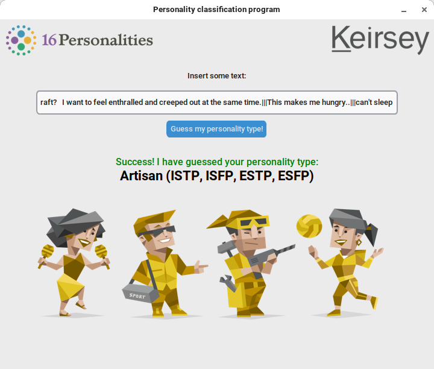
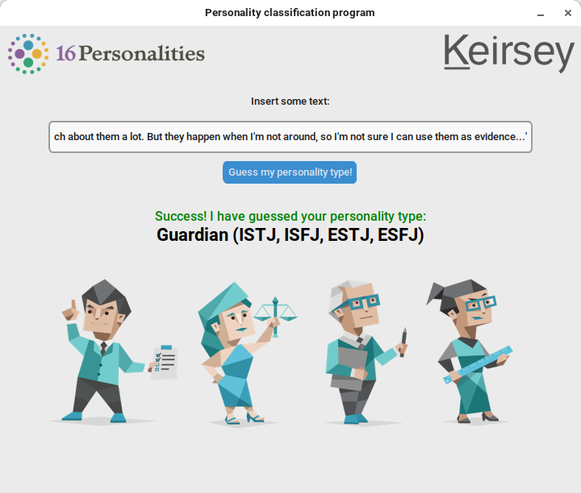
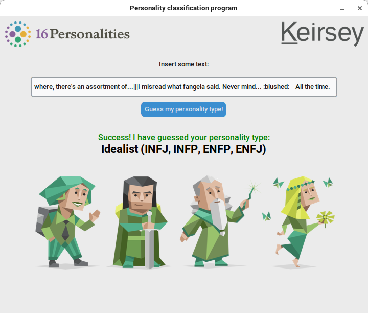
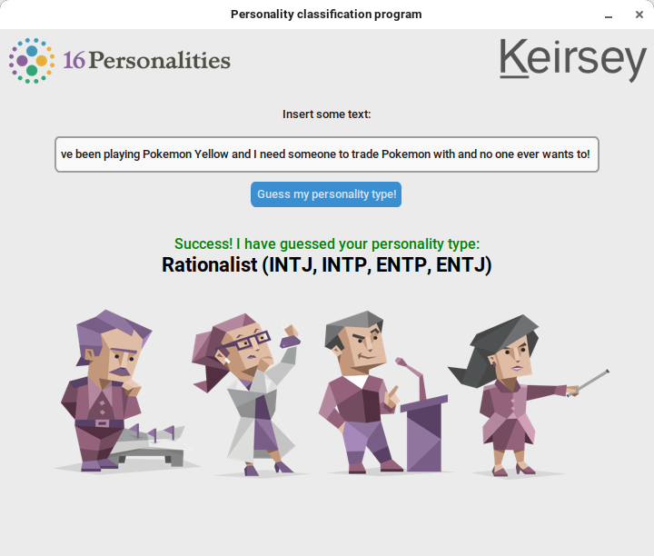

# Example program for playing around with the most accurate model

This program is a frontend for the model. It was developed for the "doors open day" at my high-school to be shown to future first-graders. The program is supposed to be a 'playground' where users can put in text and see how the model classifies it.
It's not really accurate, because the model works best with big amounts of text.

 * See [Usage](#usage) for guidance on how to use this program.
 * See [Examples](#examples) for examples of interface.

# Examples

Here are some select examples.

<table>
    <tbody>
        <tr>
            <td align="center">
                
            </td>
            <td align="center">
                
            </td align="center">
        </tr>
        <tr>
            <td align="center">
                
            </td>
            <td align="center">
                
            </td align="center">
        </tr>
    </tbody>
<table>

# Usage

### Prerequisites
Before running the program, make sure you have the following:

* Python 3.x
* Install the required packages from `requirements.txt` (located in the root folder)

To install the packages, run the following command after navigating to the root folder:  
```pip install -r requirements.txt```

### Using the scripts
After installing the packages, you can navigate to this folder and run the program with the following command:  
```python ./NLPProject_gui.py```.

Note: You can use the example texts in [example_inputs](otvorena-vrata-2023/example_inputs) to recreated the results from above.
